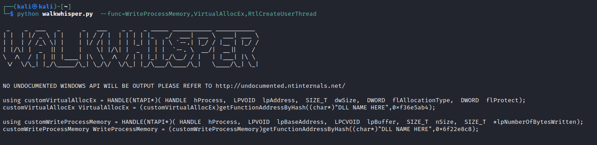
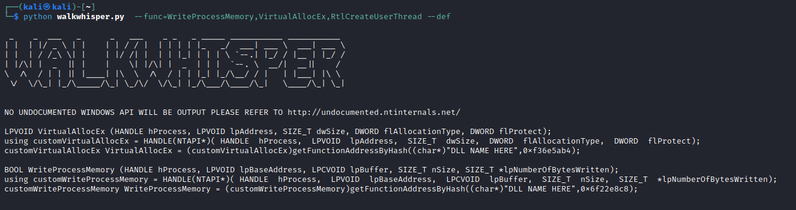

# WALKWHISPER

A simple tool to parse Windows header files in a Linux development environment. This tool is meant to aid in generating C/C++ code snippets used for Windows API hashing. The hashing method that is used is [DJB2](http://www.cse.yorku.ca/~oz/hash.html).


## Usage
```shell
usage: walkwhisper.py [-h] --func FUNC [--header HEADER] [--def]

options:
  -h, --help       show this help message and exit
  --func FUNC      A single and/or comma delimited list of Windows API functions to look up
  --header HEADER  A single or comma delimited list of the Windows header file(s) that need to be parsed
  --def            Prints the WinAPI Definition

```

## Example

If we wanted to generate some code snippets for `WriteProcessMemory`, `VirtualAllocEx`, and `RtlCreateUserThread` the following command line usage would look like so:



**NOTICE**: When attempting to generate source code for undocumented Windows API functions like `RtlCreateUserThread` in the example above a notice is provided. It is recommended to utilize the amazing source from   to notify the user that this function can not be generated and http://undocumented.ntinternals.net/ to manually create the code.

You can also output the Windows API function definition for further context like so:



## Undocumented Windows Internals
As provided in the usage of WALKWHISPER it is recommended to refer to the following site, but this may not be as reliable at times and it is suggest to review some of the other links below.

- http://undocumented.ntinternals.net/

For WALKWHISPER it may be better for you to use the source files provided by the following repositories:

- https://github.com/winsiderss/systeminformer/tree/master/phnt
- https://github.com/processhacker/phnt
- https://github.com/reactos/reactos

You can also check out the following project, but its mainly used for Windows Kernel structures and can still be valuable
- https://www.vergiliusproject.com/


## Credits

- [ASCII TEXT Generator](http://www.patorjk.com/software/taag/)
- [NSA Name Generator](http://ternus.github.io/nsaproductgenerator/)
